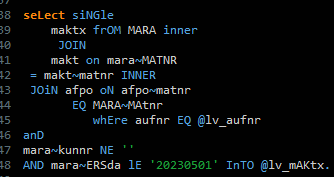
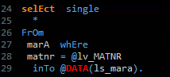

# ABAP SQL Beautifier
 

Direct installation: 
https://lukas-mb.github.io/ABAP-SQL-Beautifier-Update/

Installation via Eclipse Marketplace:
https://marketplace.eclipse.org/content/abap-sql-beautifier

 This plugin adds a quick fix to your ADT environment for formatting an ABAP SQL statement. You can customize it in the preferences:
- Align operators
- Standardize operators (e.g., convert all 'EQ' to '=')
- Add spaces to each line
- Additional spaces in condition lines
- Order of keywords (please use it wisely)
- Combine SELECT with FROM/INTO until a certain character limit
- Combine FROM with JOINs until a certain character limit

Still in Beta. If you encounter any bugs, feel free to report them.

Please note that it's disabled in some cases. These will be implemented in the future. 

Planned for Version 1:
- Convert SQL statement to new syntax
- Add escaping to host variables
- Add commas between fields
- CASE/WHEN syntax
- SELECT in WHERE

